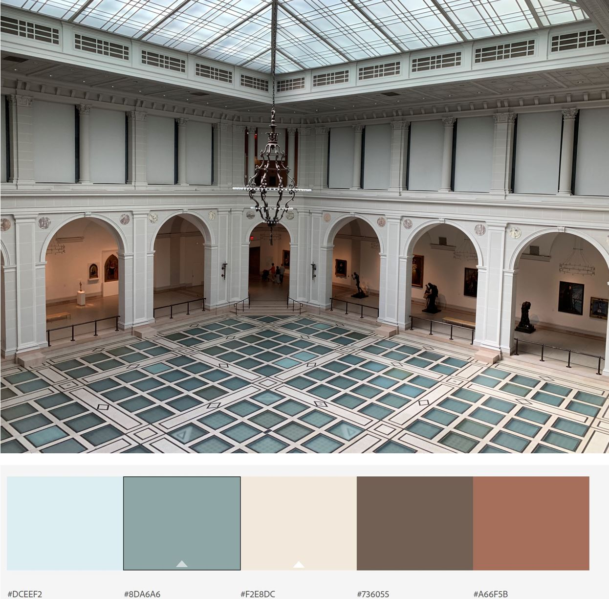
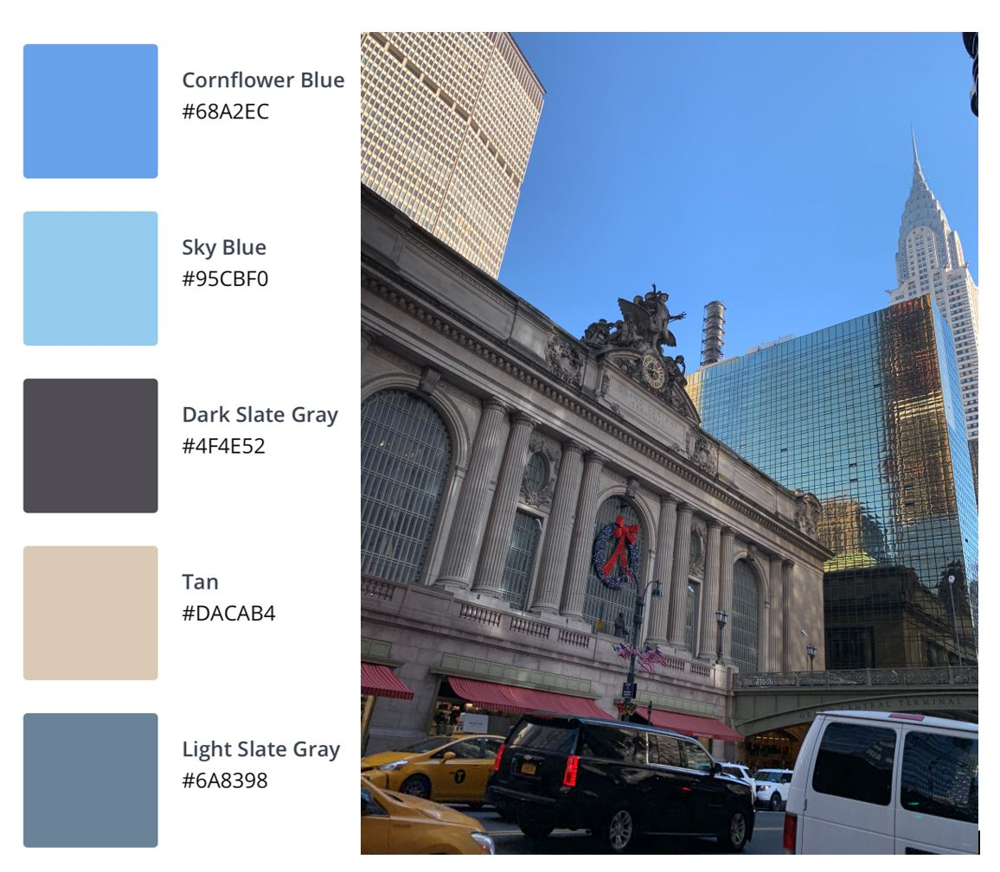

# Geographic Information Systems (GIS) Portfolio
This is my portfolio for all GIS assignments

# About Me
I'm a born and raised New Yorker who loves exploring the city and learning something about it as often as I can. As someone who attended public institutions throughout her K-12 and undergraduate education, I saw how the gaps in access to resources worsen intergenerational inequality. To learn more about quantitative methods in public policy analysis to tackle that challenge, I enrolled at Heinz College in Carnegie Mellon University to earn my Master of Science in Public Policy and Management. It's inspiring to know that there are many people who want to work in the public sector and I met many of them at Heinz. My coursework was enhanced by a GIS class I took during my second semester, which prepared me for an internship at the NYC Mayor's Office of Resiliency, and that helped me learn more about my city and apply the skills from my other classes - it was a very fulfilling experience. When I'm not busy with school and work I enjoy going on runs and getting through my reading list, but usually I'm just rewatching my favorites comedies (Parks and Rec is my all-time favorite). 

# What I Hope to Learn
More mapping techniques and tools to explore my policy interests, especially around housing and education, as well as timely issues stemming from the COVID-19 crisis. There have been many tools introduced for mapping but data visualization concepts are what determines whether the audience understands your point. One of my goals is to combine best practices from mapping and visualization to build good habits going forward, while creating a portfolio that shows my progress.

# Portfolio
## 1. Sheet Mapper Tutorial
#### Assignment Description and Products
I completed the [Mapbox Sheet Mapper tutorial](https://www.mapbox.com/impact-tools/sheet-mapper/) to show businesses in the districts of NYC Councilmember Carlina Rivera and NYS Assemblymember Yuh-Line Niou based on whether they have senior shopping hours, are a bike shop or small business. This information came from their Twitter feed between April 1 and 8 and is listed on a Google spreadsheet. To customize the code and create the website I used the Glitch app.

 * [Google Spreadsheet](https://docs.google.com/spreadsheets/d/1X9Tv_bW3JYhG05UzS5FwN-QpKZyTPy1KahnLib13im8/edit#gid=0)

 * [Map of Featured Businesses in Lower Manhattan](https://featured-lowermanhattan-businesses.glitch.me)

## 2. Create a Custom Map Style
#### [ArcGIS Vector Style Editor](https://developers.arcgis.com/vector-tile-style-editor/)
Using an picture I took during a visit to the Brooklyn Museum, I created a [custom ArcGIS map style](https://arcg.is/1nDCyb) that can be used as a basemap for other projects.

#### [Mapbox Studio Style Editor](https://docs.mapbox.com/help/tutorials/create-a-custom-style/)
This time I created a [custom Mapbox style](https://api.mapbox.com/styles/v1/jmendieta/ck9p2w1n72qu31ipb03h9xlq4.html?fresh=true&title=view&access_token=pk.eyJ1Ijoiam1lbmRpZXRhIiwiYSI6ImNrN3V6enNrbTA2ODIzZnBlbmZhZDN5azcifQ.cs3hBZjhkgwdHR_m4bD5yQ) with a color palette based generated from a picture I took of Grand Central Station then exported it to ArcGIS Online to use as a basemap.

#### [Google Style Map](https://mapstyle.withgoogle.com/)
Another way to create a custom map style is with Google's Styling Wizard, and I used a picture taken of Grand Central Station with the Chrysler Building in the background as an inspiration for the color palette. 

## 3. Final Project

For the final project, a team of students analyzed the immigrant population in the U.S. using data from the American Community Survey, the Immigration Legal Resource Center, and local and state government websites with information on COVID-19 testing sites. We wanted to show states and select counties with a high immigrant population and their access to healthcare sites compared to the county's anti-Immigration and Customs Enforcement policies and hope that advocacy organizations can use this information to target their efforts and develop strategies.

[COVID-19 and Non-Citizen Communities](https://arcg.is/1OjWnv0)
