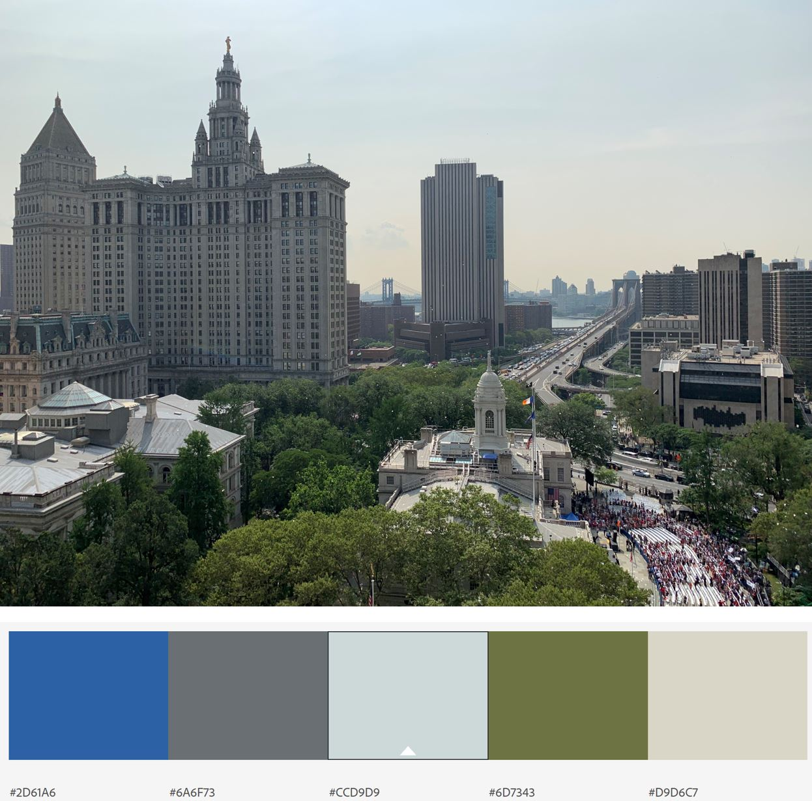
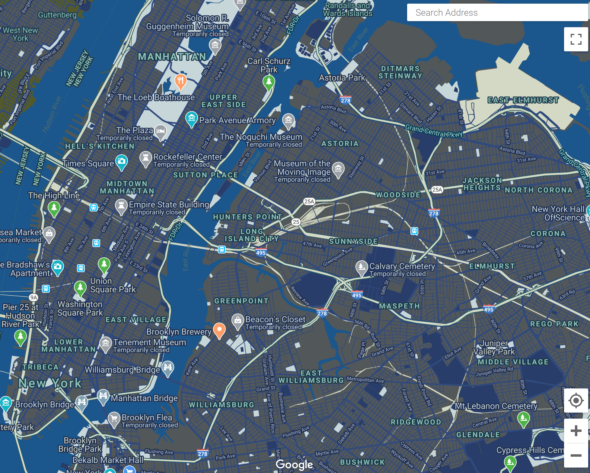
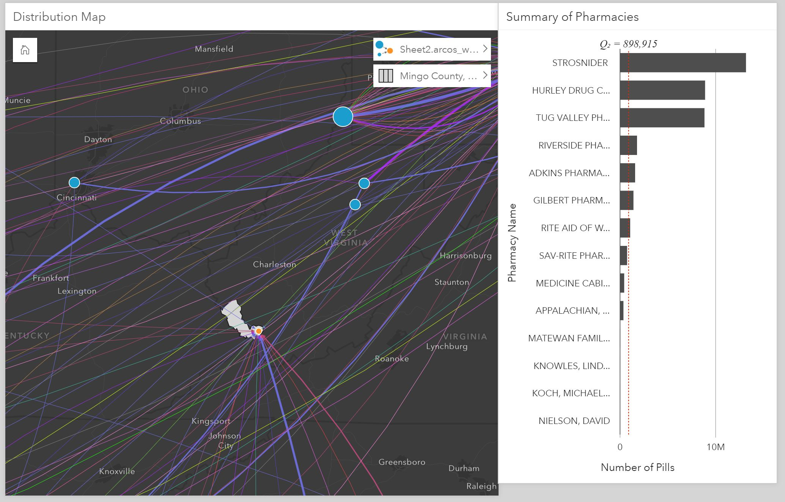
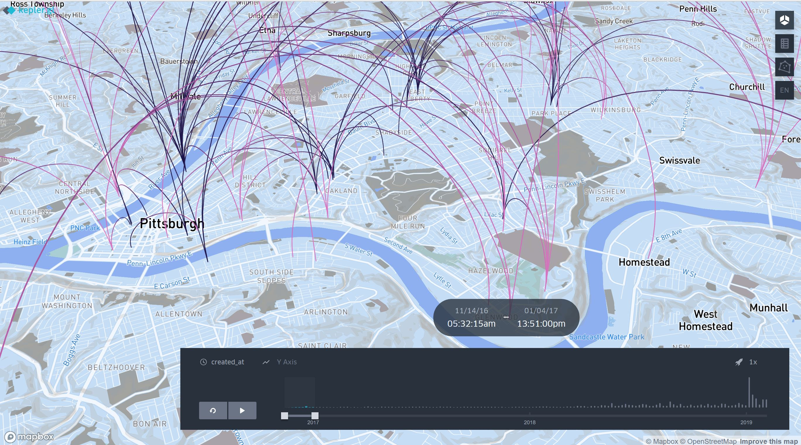

# Geographic Information Systems (GIS) Portfolio

### About Me
I'm a born and raised New Yorker who loves exploring the city and learning something about it as often as I can. As someone who attended public institutions throughout her K-12 and undergraduate education, I saw how the gaps in access to resources worsen intergenerational disparities. To learn more about quantitative methods in public policy analysis to tackle that challenge, I enrolled at Heinz College in Carnegie Mellon University to earn my Master of Science in Public Policy and Management. It's inspiring to know that there are many people who want to work in the public sector and I met many of them at Heinz. My coursework was enhanced by a GIS class I took during my second semester, which helped me learn more about my city and apply the skills from my other classes - it was a very fulfilling experience. When I'm not busy with school and work I enjoy going on runs and getting through my reading list, but usually I'm just rewatching my favorite comedies (Parks and Rec is my all-time favorite). 

### What I Hope to Learn
More mapping techniques and tools to explore my policy interests, especially around housing and education, as well as timely issues stemming from the COVID-19 crisis. There have been many tools introduced for mapping but data visualization concepts are what determine whether the audience understands your point. One of my goals is to combine best practices from mapping and visualization to build good habits going forward, while creating a portfolio that shows my progress.

# Portfolio
## 1. Final Project
For the final project, a team of students analyzed the immigrant population in the U.S. using data from the American Community Survey, the Immigration Legal Resource Center, and local and state government websites with information on COVID-19 testing sites. We wanted to show states and three counties with a high immigrant population and their access to COVID-19 healthcare compared to the county's U.S. Immigration and Customs Enforcement policies and hope that advocacy organizations can use this information to target their efforts and develop strategies to protect this vulnerable group during the emergency, reopening and recovery phases.

[COVID-19 and Non-Citizen Communities Story Map](https://arcg.is/1OjWnv0)

## 2. Sheet Mapper Tutorial
#### Assignment Description and Products
I completed the [Mapbox Sheet Mapper tutorial](https://www.mapbox.com/impact-tools/sheet-mapper/) to show businesses in the districts of NYC Councilmember Carlina Rivera and NYS Assemblymember Yuh-Line Niou based on whether they have senior shopping hours, are a bike shop or small business. This information came from their Twitter feed between April 1 and 8 and is listed on a Google spreadsheet. To customize the code and create the website I used the Glitch app.

 * [Google Spreadsheet](https://docs.google.com/spreadsheets/d/1X9Tv_bW3JYhG05UzS5FwN-QpKZyTPy1KahnLib13im8/edit#gid=0)

 * [Map of Featured Businesses in Lower Manhattan](https://featured-lowermanhattan-businesses.glitch.me)

## 3. Create a Custom Map Style
### ArcGIS Vector Style Editor
Using a color palette generated from a picture I took during a visit to the Brooklyn Museum last summer, I created a custom ArcGIS map style that can be used as a basemap for other projects.

 * [ArcGIS Custom Basemap](https://arcg.is/1nDCyb)

### Mapbox Studio Style Editor
This time I created a custom Mapbox style with their Style Editor tutorial using a color palette generated from a picture I took of Grand Central Station.

 * [Mapbox Style](https://api.mapbox.com/styles/v1/jmendieta/ck9p2w1n72qu31ipb03h9xlq4.html?fresh=true&title=view&access_token=pk.eyJ1Ijoiam1lbmRpZXRhIiwiYSI6ImNrN3V6enNrbTA2ODIzZnBlbmZhZDN5azcifQ.cs3hBZjhkgwdHR_m4bD5yQ)

### Google Style Map
Another way to create a custom map style is with Google's Styling Wizard, and I used a picture taken of City Hall during the USWNT's ticker tape parade as an inspiration for the color palette. 

## 4. Geographic Footprints
### ArcGIS Insights
This assignment had us use the desktop version of ArcGIS Insights to conduct an analysis on the [Drug Enforcement Administration's (DEA) pain pill database](https://www.washingtonpost.com/graphics/2019/investigations/dea-pain-pill-database/) released by the Washington Post. The DEA database tracks the shipment of all pain pills sold in the United States by manufacturers and distributors in every town and city. Mingo County, WV was the county selected due to its high rates of prescription compated to the number of residents in the surrounding area.
Below is a screenshot of Mingo County by the distribution map of sellers to pharmacies compared to the number of pharmacies with the highest number of shipments. The amount of pills shipped to the Countyis alarming given the small number of distributors and population.

### Kepler
A handy open source tool for geospatial datasets is [Kepler](http://kepler.gl/), and using data downloaded from [412 Food Rescue](https://412foodrescue.org/), a nonprofit organization based in Pittsburgh, PA, I looked at the concentration of food donors between November 14, 2016 and January 4, 2017 using the custom map style I created with Mapbox. Oakland, the Strip District, and East Liberty were neighborhoods with a high number of donor points and many of the arcs led to Hazelwood and Wilkinsburg. This tool is helpful to determine the neighborhoods with active participant, whether they're donors or recipients, which can inform the 412 Food Rescue team on where to target their outreach.

